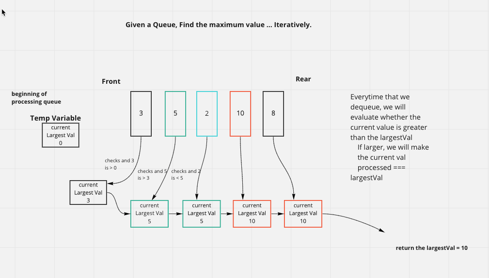
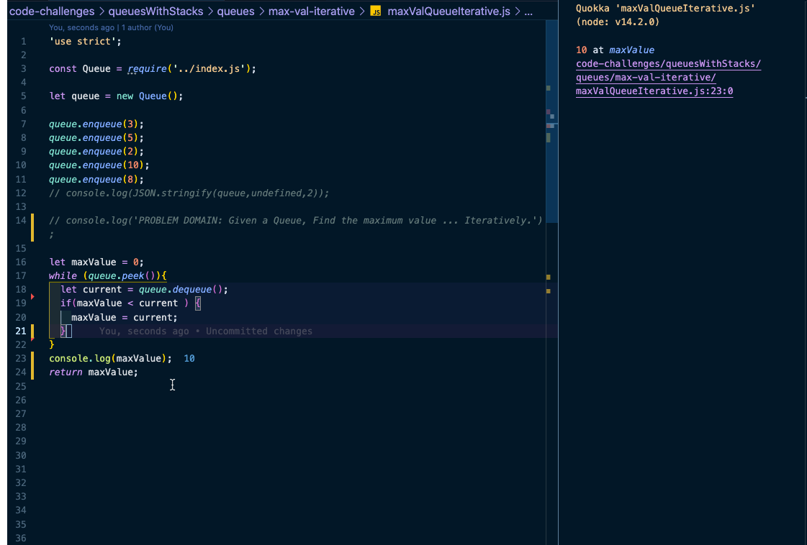

## Given a Array, Remove all duplicate values/keys ... Iteratively.

### [pull request](https://github.com/Chris-Bortel-401-advanced-javascript/dsa-practice/pull/2)

### White Board
<!--  -->

### Code
<!--  -->

### Resources
[Medium: Using Set(), filter(), or reduce()](https://medium.com/dailyjs/how-to-remove-array-duplicates-in-es6-5daa8789641c)

- [Better leet code example](https://www.youtube.com/watch?v=zIHe2V5Py3U)

- [Leet Code example](https://www.youtube.com/watch?v=6-OX8mMqoMw)
