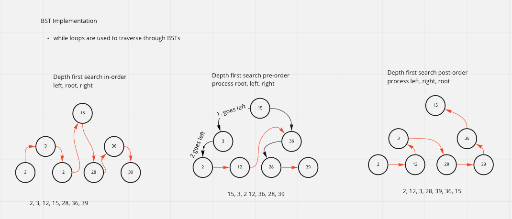

## BST Implementation adn traversal

### [pull request](https://github.com/Chris-Bortel-401-advanced-javascript/dsa-practice/pull/4)

## Given a BST, Find the MINIMUM value ... Iteratively.

## Given a BST, Find the MAXIMUM value ... Iteratively.

## Searching
 

### White Board

### Solved Code
<!--  -->