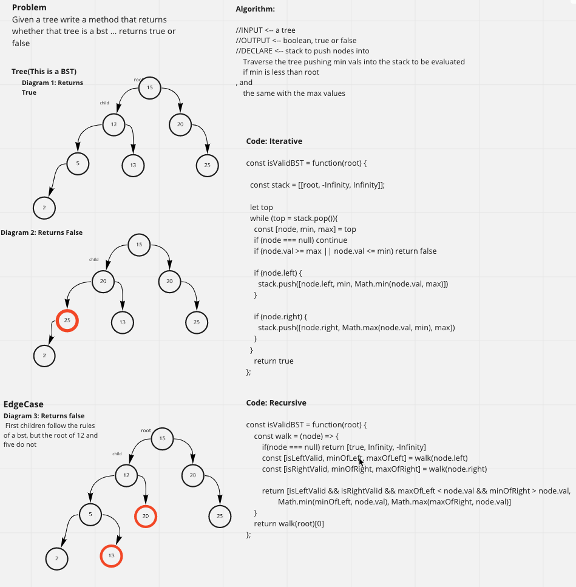

# Validate a binary search tree
## Give a tree, write a method that returns whether that tree is a BST

### [pull request](https://github.com/Chris-Bortel-401-advanced-javascript/dsa-practice/pull/5)

### White Board

### Code
<!--  -->

### Resources
- [Leet Code Question](https://leetcode.com/problems/validate-binary-search-tree/)

- [Leet Code, four ways to solve this](https://www.youtube.com/watch?v=sfc0BjiMbI8&t=357s)
