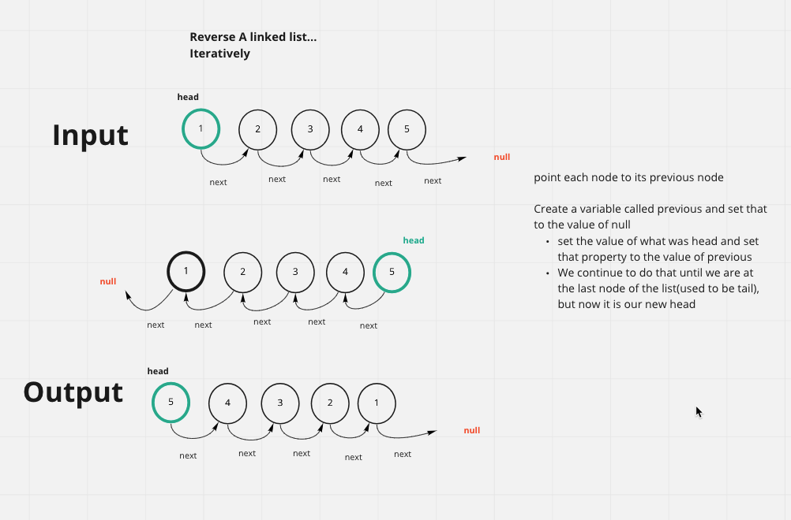

## Reverse a linked lists values ... Iteratively.

### [pull request](https://github.com/Chris-Bortel-401-advanced-javascript/dsa-practice/pull/5)

### White Board

### Code
<!--  -->

### Resources
- [Leet Code Question](https://leetcode.com/problems/reverse-linked-list/)

- [Leet Code, iteratively and recursively](https://www.youtube.com/watch?v=W-EfGB0E_ao)

- [Reversing ll ... With good explanation](https://www.youtube.com/watch?v=UCv-EmtvPe4)
