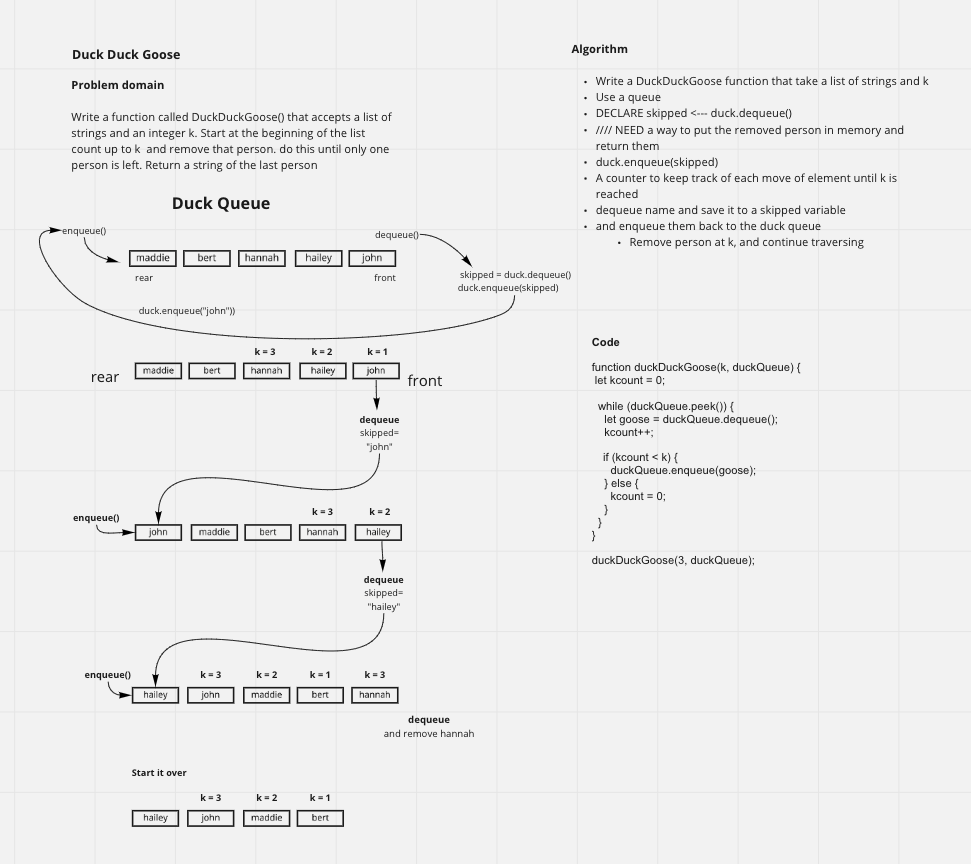

# Duck Duck Goose

<!-- Description of the challenge -->

- Write a function called DuckDuckGoose() that accepts a list of strings and an integer k. Start at the beginning of the list count up to k and remove that person. do this until only one person is left. Return a string of the last person

## Approach & Efficiency

<!-- What approach did you take? Why? What is the Big O space/time for this approach? -->

- Dequeue the front person off of the queue, and then enqueue that person to the back of the queue. While doing that, increment the count up one until the k condition is met. Once the condition is met, dequeue that person, do not enqueue them, reset the counter to zero, and continue the process until there is only on person left. Return the last person.

- The Big O of time and space is O(n) because it is only going to be as big and the number of times that it needs to go through the loop. We are doing it in place, so there are not additional structures to slow it down or take up space.

## Solution

<!-- Embedded whiteboard image -->

