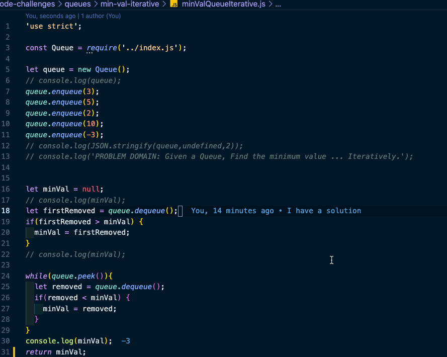

## Given a Queue, Find the minimum value ... Iteratively.

### [pull request](https://github.com/Chris-Bortel-401-advanced-javascript/dsa-practice/pull/3)

### White Board
<!--  -->
- No white board
### Solution Code
