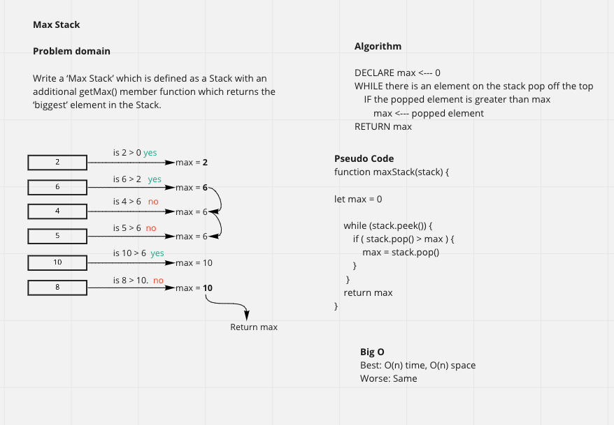

# Max Stack

<!-- Description of the challenge -->

- Write a ‘Max Stack’ which is defined as a Stack with an additional getMax() member function which returns the ‘biggest’ element in the Stack.

<!-- ## Approach & Efficiency -->

<!-- What approach did you take? Why? What is the Big O space/time for this approach? -->

## Solution

<!-- Embedded whiteboard image -->

